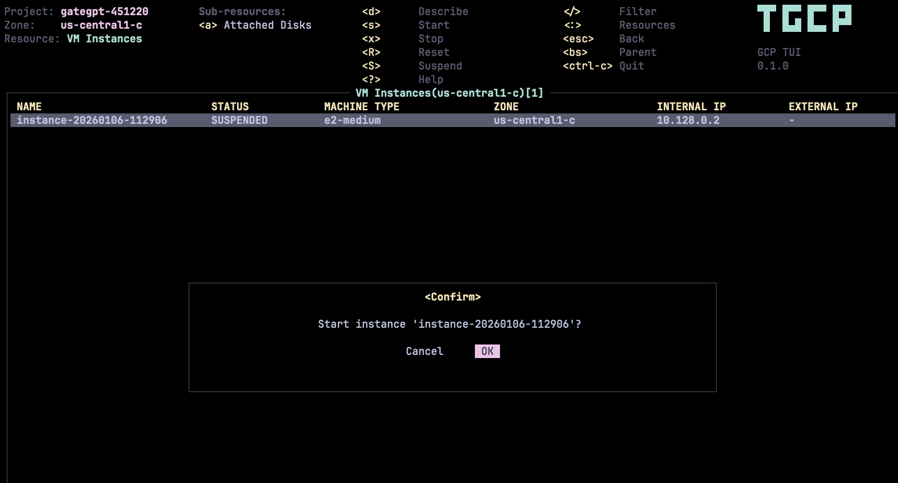

<p align="center">
  
</p>

# tgcp - Terminal UI for GCP

**tgcp** provides a terminal UI to interact with your Google Cloud Platform resources. The aim of this project is to make it easier to navigate, observe, and manage your GCP infrastructure in the wild. tgcp continually watches GCP for changes and offers subsequent commands to interact with your observed resources.

---

[](LICENSE)
[](https://www.rust-lang.org/)

---

## Screenshots

<p align="center">
  
</p>

---

## Features

- **Multi-Project Support** - Easily switch between GCP projects
- **Multi-Zone Support** - Navigate across different zones and regions
- **60+ Resource Types** - Browse and manage resources across 30+ GCP services
- **Real-time Updates** - Auto-refresh resources every 5 seconds
- **Keyboard-Driven** - Vim-like navigation and commands
- **Detailed Views** - JSON view of resource details with syntax highlighting
- **Filtering** - Filter resources by name or attributes
- **Autocomplete** - Smart resource type autocomplete with fuzzy matching
- **No gcloud dependency** - Native authentication, works standalone
- **Persistent Config** - Remembers your last project and zone

---

## Installation

### Homebrew (macOS/Linux)

```bash
brew install huseyinbabal/tap/tgcp
```

### Scoop (Windows)

```powershell
scoop bucket add huseyinbabal https://github.com/huseyinbabal/scoop-bucket
scoop install tgcp
```

### Download Pre-built Binaries

Download the latest release from the [Releases page](https://github.com/huseyinbabal/tgcp/releases/latest).

| Platform | Architecture | Download |
|----------|--------------|----------|
| **macOS** | Apple Silicon (M1/M2/M3) | `tgcp-aarch64-apple-darwin.tar.gz` |
| **macOS** | Intel | `tgcp-x86_64-apple-darwin.tar.gz` |
| **Linux** | x86_64 | `tgcp-x86_64-unknown-linux-gnu.tar.gz` |
| **Linux** | ARM64 | `tgcp-aarch64-unknown-linux-gnu.tar.gz` |
| **Windows** | x86_64 | `tgcp-x86_64-pc-windows-msvc.zip` |

#### Quick Install (macOS/Linux)

```bash
# macOS Apple Silicon
curl -sL https://github.com/huseyinbabal/tgcp/releases/latest/download/tgcp-aarch64-apple-darwin.tar.gz | tar xz
sudo mv tgcp /usr/local/bin/

# macOS Intel
curl -sL https://github.com/huseyinbabal/tgcp/releases/latest/download/tgcp-x86_64-apple-darwin.tar.gz | tar xz
sudo mv tgcp /usr/local/bin/

# Linux x86_64
curl -sL https://github.com/huseyinbabal/tgcp/releases/latest/download/tgcp-x86_64-unknown-linux-gnu.tar.gz | tar xz
sudo mv tgcp /usr/local/bin/

# Linux ARM64
curl -sL https://github.com/huseyinbabal/tgcp/releases/latest/download/tgcp-aarch64-unknown-linux-gnu.tar.gz | tar xz
sudo mv tgcp /usr/local/bin/
```

#### Windows

1. Download `tgcp-x86_64-pc-windows-msvc.zip` from the [Releases page](https://github.com/huseyinbabal/tgcp/releases/latest)
2. Extract the zip file
3. Add the extracted folder to your PATH, or move `tgcp.exe` to a directory in your PATH

### Using Cargo

```bash
cargo install tgcp
```

### From Source

tgcp is built with Rust. Make sure you have Rust 1.70+ installed, along with a C compiler and linker.

```bash
# Clone the repository
git clone https://github.com/huseyinbabal/tgcp.git
cd tgcp

# Build and run
cargo build --release
./target/release/tgcp
```

---

## Prerequisites

- **GCP Credentials** - See [Authentication](#authentication) section below
- **IAM Permissions** - Your GCP user/service account needs appropriate read permissions for the services you want to browse. At minimum, you'll need `Viewer` role or specific `*.get` and `*.list` permissions.

---

## Authentication

tgcp uses a credential chain, trying each source in order:

| Priority | Source | Description |
|----------|--------|-------------|
| 1 | `GCP_ACCESS_TOKEN` | Direct access token (useful for CI/CD) |
| 2 | `GOOGLE_CREDENTIALS` | Inline JSON credentials in environment variable |
| 3 | `GOOGLE_APPLICATION_CREDENTIALS` | Path to service account JSON file |
| 4 | Application Default Credentials | `~/.config/gcloud/application_default_credentials.json` |
| 5 | GCP Metadata Server | Automatic on Compute Engine, Cloud Run, GKE |

### Using Application Default Credentials (Recommended for Development)

```bash
# Login and create ADC file
gcloud auth application-default login

# Then simply run tgcp
tgcp
```

### Using Service Account

```bash
# Set path to service account JSON
export GOOGLE_APPLICATION_CREDENTIALS=/path/to/service-account.json
tgcp

# Or inline JSON
export GOOGLE_CREDENTIALS='{"type":"service_account","project_id":"..."}'
tgcp
```

### Running on GCP Infrastructure

When running on Compute Engine, Cloud Run, or GKE, tgcp automatically uses the metadata server for authentication. No configuration needed.

---

## Quick Start

```bash
# Launch tgcp (uses default project from credentials)
tgcp

# Launch in a specific zone
tgcp --zone us-central1-a

# Launch in read-only mode (blocks all write operations)
tgcp --readonly

# Enable debug logging
tgcp --log-level debug
```

---

## Key Bindings

| Action | Key | Description |
|--------|-----|-------------|
| **Navigation** | | |
| Move up | `k` / `↑` | Move selection up |
| Move down | `j` / `↓` | Move selection down |
| Top | `gg` | Jump to first item |
| Bottom | `G` | Jump to last item |
| **Views** | | |
| Resource picker | `:` | Open resource type selector |
| Describe | `Enter` / `d` | View resource details |
| Back | `Backspace` / `Esc` | Go back to previous view |
| Help | `?` | Show help screen |
| **Actions** | | |
| Refresh | `r` | Refresh current view |
| Filter | `/` | Filter resources |
| Projects | `:projects` | Switch GCP project |
| Zones | `:zones` | Switch zone |
| Quit | `q` / `Ctrl+c` | Exit tgcp |
| **VM Instance Actions** | | |
| Start instance | `s` | Start selected VM instance |
| Stop instance | `x` | Stop selected VM instance |
| Reset instance | `R` | Hard reset selected VM instance |
| Suspend instance | `S` | Suspend selected VM instance |
| Resume instance | `e` | Resume suspended VM instance |
| Delete instance | `Ctrl+d` | Delete selected VM instance |

---

## Supported GCP Services (60+ Resources)

tgcp supports **30+ GCP services** with **60+ resource types**:

### Compute & Containers
| Service | Resources | Command |
|---------|-----------|---------|
| **Compute Engine** | Instances, Disks, Snapshots, Images, Machine Types | `:vm-instances`, `:disks` |
| **GKE** | Clusters, Node Pools | `:gke-clusters`, `:node-pools` |
| **Cloud Run** | Services, Revisions, Jobs | `:cloudrun-services`, `:cloudrun-jobs` |
| **Cloud Functions** | Functions (v2) | `:functions` |
| **App Engine** | Services, Versions | `:appengine-services` |

### Networking
| Service | Resources | Command |
|---------|-----------|---------|
| **VPC** | Networks, Subnets, Firewalls, Routes | `:networks`, `:subnets`, `:firewalls` |
| **Load Balancing** | Forwarding Rules, Backend Services, Health Checks, URL Maps, SSL Certificates | `:forwarding-rules`, `:backend-services` |
| **Cloud DNS** | Managed Zones, Record Sets | `:dns-zones`, `:dns-records` |
| **API Gateway** | APIs, Gateways | `:api-gateways`, `:api-gateway-apis` |
| **Service Directory** | Namespaces, Services, Endpoints | `:sd-namespaces`, `:sd-services` |
| **Cloud Endpoints** | Services | `:endpoints-services` |

### Storage & Databases
| Service | Resources | Command |
|---------|-----------|---------|
| **Cloud Storage** | Buckets | `:buckets` |
| **Cloud SQL** | Instances, Databases | `:sql-instances`, `:sql-databases` |
| **Cloud Spanner** | Instances, Databases | `:spanner-instances`, `:spanner-databases` |
| **Memorystore** | Redis Instances, Memcached Instances | `:redis-instances`, `:memcached-instances` |
| **Filestore** | Instances | `:filestore-instances` |
| **BigQuery** | Datasets, Tables, Jobs | `:bq-datasets`, `:bq-tables`, `:bq-jobs` |

### Data & Analytics
| Service | Resources | Command |
|---------|-----------|---------|
| **Pub/Sub** | Topics, Subscriptions | `:pubsub-topics`, `:pubsub-subscriptions` |
| **Dataflow** | Jobs | `:dataflow-jobs` |
| **Dataproc** | Clusters, Jobs | `:dataproc-clusters`, `:dataproc-jobs` |
| **Composer** | Environments | `:composer-envs` |

### Security & Identity
| Service | Resources | Command |
|---------|-----------|---------|
| **IAM** | Service Accounts, Keys | `:service-accounts`, `:sa-keys` |
| **Secret Manager** | Secrets, Versions | `:secrets`, `:secret-versions` |
| **Cloud KMS** | Key Rings, Crypto Keys, Key Versions | `:kms-keyrings`, `:kms-keys` |

### DevOps & CI/CD
| Service | Resources | Command |
|---------|-----------|---------|
| **Cloud Build** | Triggers, Builds | `:build-triggers`, `:builds` |
| **Artifact Registry** | Repositories, Docker Images | `:artifact-repos`, `:docker-images` |
| **Cloud Scheduler** | Jobs | `:scheduler-jobs` |
| **Cloud Tasks** | Queues | `:task-queues` |
| **Workflows** | Workflows, Executions | `:workflows`, `:workflow-executions` |

### Operations
| Service | Resources | Command |
|---------|-----------|---------|
| **Cloud Logging** | Log Sinks, Log Metrics | `:log-sinks`, `:log-metrics` |
| **Cloud Monitoring** | Alert Policies, Uptime Checks, Notification Channels | `:alert-policies`, `:uptime-checks` |

> **Missing a service?** [Start a discussion](https://github.com/huseyinbabal/tgcp/discussions/new?category=ideas) to propose adding it!

---

## Configuration

### Config File

tgcp stores configuration in `~/.config/tgcp/config.yaml`:

```yaml
project: my-gcp-project
zone: us-central1-a
last_resource: vm-instances
```

### Environment Variables

| Variable | Description |
|----------|-------------|
| `GCP_PROJECT` | Default GCP project to use |
| `GOOGLE_CLOUD_PROJECT` | Alternative project variable |
| `GCLOUD_PROJECT` | Alternative project variable |
| `CLOUDSDK_COMPUTE_ZONE` | Default zone |
| `GCP_ACCESS_TOKEN` | Direct access token |
| `GOOGLE_APPLICATION_CREDENTIALS` | Path to service account JSON |
| `GOOGLE_CREDENTIALS` | Inline JSON credentials |

---

## Contributing

Contributions are welcome! Please see our [Contributing Guide](CONTRIBUTING.md) for details.

**Important:** Before adding a new GCP service, please [start a discussion](https://github.com/huseyinbabal/tgcp/discussions/new?category=ideas) first.

---

## Acknowledgments

- Inspired by [k9s](https://github.com/derailed/k9s) - the awesome Kubernetes CLI
- Sister project to [taws](https://github.com/huseyinbabal/taws) - Terminal UI for AWS
- Built with [Ratatui](https://github.com/ratatui-org/ratatui) - Rust TUI library

---

## License

This project is licensed under the MIT License - see the [LICENSE](LICENSE) file for details.

---

<p align="center">
  Made with love for the GCP community
</p>
